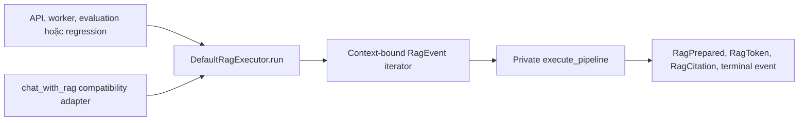

# Tổng kết đợt refactor RAG request execution bằng typed event facade

Ngày cập nhật: 2026-07-18
Trạng thái: đã hoàn tất correctness refactor, post-review hardening và double-review
Phạm vi commit gốc: `6bc71b1` -> `1e8ec98` -> `351d53d`

## 1. Vì sao thực hiện đợt refactor này

Trước đợt refactor, lifecycle của một RAG request bị phân tán giữa `chat_with_rag`, API streaming, worker, evaluation và regression runner. Interface chính là five-tuple chứa stream cùng nhiều giá trị phụ. Cách này có các vấn đề:

- Caller phải tự biết tuple chứa gì và tự xử lý stream, lỗi, citation, cancellation.
- API, worker và evaluation có thể diễn giải kết quả khác nhau.
- Trạng thái request như execution mode, deadline, retry budget và cancellation chưa có một owner rõ ràng.
- `chat_with_rag` vừa orchestration vừa làm compatibility boundary, khó kiểm tra event ordering.
- Context dùng `ContextVar` có nguy cơ rò rỉ khi generator giữ context xuyên qua `yield`.
- Query decomposition chạy nhiều worker nhưng chưa bảo đảm từng branch kế thừa đúng context của request cha.
- Retry budget có thể bị race hoặc bị các catch-all chuyển thành fallback.

Mục tiêu của đợt này là tạo một execution seam có kiểu rõ ràng, gom lifecycle request vào một module, sau đó sửa các lỗi correctness về context, concurrency, budget và legacy parity.

## 2. Kiến trúc sau refactor

Seam thực thi RAG chính hiện nay là:

```python
RagExecutor.run(
    request: RagRequest,
    invocation: RagInvocation,
    cancellation: CancellationSignal,
) -> Iterator[RagEvent]
```

Luồng tổng quát:



Các kiểu chính:

- `AccessScope`: phạm vi RBAC đã chuẩn hóa cho request.
- `RagRequest`: dữ liệu nghiệp vụ của câu hỏi.
- `RagInvocation`: trace ID và execution mode của lần gọi.
- `RagPrepared`: metadata đã chuẩn bị trước khi phát token.
- `RagToken`: một phần nội dung trả lời.
- `RagCitation`: citation đã được attribution.
- `RagCompleted`: terminal event thành công hoặc refusal hợp lệ.
- `RagFailed`: terminal event lỗi.
- `RagCancelled`: terminal event bị hủy.
- `RagDiagnostics`: diagnostics có kiểu nhưng vẫn hoạt động như mapping cũ.

## 3. Giai đoạn 1: tạo typed request execution seam

Commit: `6bc71b1 refactor(rag): add typed request execution seam`

### 3.1. Thêm module execution

Tạo `src/mech_chatbot/rag/execution.py` để sở hữu:

- Request types và event types.
- `RagExecutor` protocol.
- `DefaultRagExecutor` implementation.
- Logic gom event thành kết quả đồng bộ qua `collect_rag_events`.
- Logic attribution citation qua stable `SourceID`.
- Chuẩn hóa completion outcome và refusal reason.

### 3.2. Chuyển pipeline thành implementation phía sau facade

- Orchestration thật được đưa về private execution path trong `pipeline.py`.
- `DefaultRagExecutor` gọi private pipeline rồi chuyển kết quả thành typed events.
- Không yêu cầu chia nhỏ toàn bộ pipeline trong giai đoạn này.

### 3.3. Chuyển các consumer sang typed events

- RAG API streaming đọc `RagPrepared`, `RagToken`, `RagCitation` và terminal event.
- RAG API đồng bộ dùng `collect_rag_events`.
- RAG worker dùng typed request/result thay cho tự giải five-tuple.
- Regression runner dùng cùng event contract.
- Các integration/evaluation consumer liên quan bắt đầu dùng chung execution seam.

SSE payload gửi ra browser không bị đổi shape; chỉ cách backend tạo payload được chuyển sang typed events.

### 3.4. Giữ legacy compatibility

`chat_with_rag` được giữ làm adapter tương thích:

- Giữ nguyên 13 tham số.
- Giữ five-tuple: stream, ref text, ref images, part IDs và debug dictionary.
- Giữ cùng mutable debug dictionary; dictionary tiếp tục được cập nhật sau khi stream được consume.
- Không bắt caller legacy phải chuyển đổi ngay trong cùng release.

## 4. Giai đoạn 2: harden lifecycle, diagnostics và request budget

Commit: `1e8ec98 refactor(rag): harden request execution lifecycle`

### 4.1. Thêm request-local execution state

Tạo `_ExecutionState` làm composition root cho đúng một request. State này sở hữu:

- Request, invocation và cancellation signal.
- Trace ID.
- Request budget ledger.
- Phase hiện tại của pipeline.
- Refusal reason và generation outcome.
- Chuyển đổi five-tuple nội bộ thành `_PreparedExecution`.

Pipeline ghi nhận các phase như preparation, routing, retrieval, evidence và generation qua state thay vì duy trì nhiều biến lifecycle rời rạc.

### 4.2. Typed diagnostics nhưng giữ mapping compatibility

Thêm:

- `EvidenceDiagnostics`.
- `BudgetDiagnostics`.
- `GenerationDiagnostics`.
- `RagDiagnostics`.

`RagDiagnostics` vẫn triển khai Mapping và giữ raw keys cũ. Vì vậy API serialization và legacy debug payload không bị mất field dù code mới có typed view.

### 4.3. Request-wide budget

Thêm `RequestBudgetLimits` và `RequestBudgetLedger` để giới hạn toàn request:

- Planner calls.
- Số subquery.
- Corrective retrieval.
- Claim repair.
- Grounded calculations.
- Graph edges.
- Provider retries.
- Final generations.
- Request deadline.

Budget được truyền vào planner, HyDE, correction, vision, generation và claim-repair. LLM retry hook có thể lấy ledger hiện tại từ request context nếu caller không truyền trực tiếp.

Giới hạn provider retry được đặt ở cấp request, không phải cấp từng provider call.

### 4.4. Execution mode và trace context

Thêm request-local execution context cho các mode:

- `production`.
- `evaluation`.
- `test`.
- `pilot_replay`.

Các evaluation script được chuyển sang tạo `RagInvocation(mode="evaluation")` thay vì phụ thuộc hoàn toàn vào process-wide environment.

Trace logging tự lấy execution context của request. Pilot replay:

- Tắt cache read/write trong phạm vi request.
- Redact các field trace nhạy cảm như question, prompt, query và content.

### 4.5. Deadline và cancellation

- Request deadline được dùng xuyên suốt retrieval và generation.
- Generation kiểm tra cancellation/deadline trước và trong khi stream.
- Setup failure vẫn được biểu diễn bằng event contract, không phá public stream bằng exception trực tiếp từ `run()`.
- Regression consumer giữ partial answer đã nhận nếu stream lỗi sau khi đã phát token.

## 5. Giai đoạn 3: sửa context isolation, concurrency và legacy parity

Commit cuối: `351d53d refactor(rag): isolate typed event execution contexts`

Đây là đợt correctness refactor cuối sau khi seam và lifecycle đã tồn tại.

### 5.1. Sửa lỗi generator giữ ContextVar xuyên qua yield

Vấn đề được tái hiện:

- Stream evaluation A phát `RagPrepared` rồi tạm dừng.
- Stream production B bắt đầu trên cùng thread.
- Context của A có thể trở thành ambient context của B.
- Khi quay lại A, budget hoặc execution mode có thể trỏ sang request B.
- Đóng iterator không theo thứ tự LIFO có thể reset context sai.

Giải pháp là `_ContextBoundRagIterator`:

- Mỗi iterator sở hữu một `contextvars.Context` riêng.
- Source generator chỉ được tạo khi caller gọi `next()` lần đầu.
- `next()`, setup và `close()` đều chạy qua context riêng đó.
- `close()` idempotent.
- Hai iterator xen kẽ hoặc đóng không theo LIFO không làm rò execution mode, budget, cache-disable hoặc trace-redaction.
- `run()` vẫn lazy; retrieval không chạy tại thời điểm tạo iterator.

### 5.2. Khôi phục đúng legacy call-time behavior

Private iterator có bước `prepare_for_legacy()` để legacy adapter chỉ ép chạy preparation, không consume token đầu tiên.

Kết quả:

- Setup failure được ném ngay tại lời gọi `chat_with_rag`.
- Pre-cancellation được ném ngay tại lời gọi `chat_with_rag`.
- Success path trả five-tuple sau preparation nhưng chưa bắt đầu consume answer token.
- Mutable debug dictionary vẫn là cùng một object trước và sau khi consume stream.
- Public typed event caller vẫn nhận `RagPrepared` rồi `RagFailed` hoặc `RagCancelled`; không bị exception trực tiếp từ `run()`.

### 5.3. Sửa context của query-decomposition worker

Mỗi branch submit vào `ThreadPoolExecutor` bằng một `copy_context()` riêng:

```python
executor.submit(copy_context().run, run, query)
```

Không dùng chung một `Context` đồng thời giữa nhiều thread.

Mỗi branch hiện nhìn thấy đúng:

- Execution mode của request cha.
- Cùng request budget ledger.
- Pilot replay cache-disable.
- Pilot replay trace-redaction.

### 5.4. Làm request budget atomic

`RequestBudgetLedger.record()` được bảo vệ bằng lock. Read, tính proposed value, so limit và write nằm trong cùng critical section.

Điều này ngăn hai worker đồng thời cùng đọc một giá trị cũ rồi cùng cho phép retry vượt trần.

Khi hai branch cùng retry:

- Tổng số provider retry được phép trên toàn request vẫn tối đa hai.
- Lần xin retry vượt budget không được thực hiện.
- Request kết thúc bằng `RagFailed`.

### 5.5. Thêm typed budget control-flow error

Thêm private `RequestBudgetExceeded(RuntimeError)` để phân biệt budget violation với lỗi provider thông thường.

Các fallback có catch-all trên RAG path được sửa để không nuốt lỗi này, gồm các đường chính:

- Evidence verifier.
- Intent extraction và context analysis.
- LLM route classifier và interaction router.
- Planner fallback.
- Decomposed corrective retrieval.
- HyDE.
- Graph retrieval.
- Main corrective retrieval.
- History summary.
- Vision analysis.

Một finding P2 trong Spec review phát hiện `interaction_router.classify` vẫn còn outer catch-all chuyển budget error thành default `technical_query`. Finding này đã được tái hiện bằng test đỏ, sửa tại router boundary và re-review thành công.

## 6. Event contract hiện tại

| Trường hợp | Event contract |
|---|---|
| Request được consume hết bình thường | Đúng một `RagPrepared`, sau đó token/citation nếu có, rồi đúng một terminal event |
| Setup failure | `RagPrepared` rồi `RagFailed` |
| Pre-cancellation | `RagPrepared` rồi `RagCancelled` |
| Thành công hoặc refusal hợp lệ | Terminal là `RagCompleted` với outcome/refusal reason phù hợp |
| Budget/deadline/provider failure | Terminal là `RagFailed` |
| Caller đóng stream sớm | Không bắt buộc phát terminal nhưng phải cleanup idempotent |
| Legacy setup failure/pre-cancel | Ném ngay tại lời gọi `chat_with_rag` |
| Legacy success | Trả nguyên five-tuple, chưa consume token đầu tiên |

## 7. Những behavior được giữ nguyên

Đợt refactor không thay đổi:

- `RagRequest`, `RagInvocation` và public event wire contract sau khi đã được giới thiệu.
- SSE event/payload shape gửi cho browser.
- RBAC scope và server-side user profile behavior.
- Citation attribution và stable `SourceID` behavior.
- Refusal classification và explicit-negative behavior.
- Nội dung rollout decision, release decision hoặc trạng thái các wave. Tuy
  nhiên mọi evidence gắn commit trước refactor phải được tạo lại trước rollout.
- Five-tuple và 13 tham số của `chat_with_rag`.
- Mutable debug lifecycle của legacy caller.

## 8. Test đã bổ sung

Các correctness test chính được thêm theo hướng red-green:

- Hai event stream evaluation/production xen kẽ trên cùng thread.
- Đóng iterator không theo LIFO và gọi close nhiều lần.
- Không rò execution mode hoặc request budget ra ambient context.
- Decomposition branch nhận đúng context và cùng ledger.
- Hai branch retry đồng thời nhưng tổng retry không vượt hai.
- Budget error không bị evidence, planner hoặc router fallback nuốt.
- Pilot replay branch vẫn tắt cache và redact trace.
- Setup failure và pre-cancel của legacy xảy ra tại call-time.
- Legacy success không consume token trước khi caller bắt đầu stream.
- Five-tuple và mutable debug dictionary không đổi.
- Vision vượt request retry budget phải fail-closed.
- Typed invocation giữ nguyên mode được caller chỉ định, không nhận mode ambient.
- Evaluator chính dùng `RagInvocation(mode="evaluation")` và giữ failure telemetry.
- Shared event consumer giữ typed failure diagnostics nhưng compatibility collector
  vẫn ném đúng original exception.
- Pilot replay được ghi nguyên mode trong trace JSON.
- Deployment preflight pin production mode, tắt evaluation override và bắt buộc
  deadline đúng 120 giây.
- Final pilot gate ràng buộc latency artifact theo từng arm/window, từ chối dùng
  chung trace/artifact/trace ID và đối chiếu query count, P50/P95 cùng cost.

Các suite tương thích đã chạy lại:

- Typed execution contract.
- Strict streaming và streaming policy.
- Explicit-negative answer policy.
- Grounded math.
- Cancellation.
- Regression events.
- API/SSE streaming.
- Query decomposition, intent và interaction router.
- Full project test suite.

Kết quả cuối:

- Full suite chạy đến 100%, exit code 0.
- 22 integration/evaluation tests cần SQL, Qdrant, RAG server hoặc isolated encoder được skip đúng cấu hình.
- `compileall` thành công.
- App API và RAG API tạo OpenAPI schema thành công.
- `git diff --check` sạch.

Trên Windows, faulthandler có thể in cảnh báo native `pyarrow` trong một số targeted run. Full suite được chạy lại bằng terminal session dài hạn và hoàn tất với exit code 0; cảnh báo này không được phân loại là regression của refactor.

## 9. Double-review

Diff cuối được review độc lập so với fixed point `1e8ec98ccf990bc35baf204bae43e35e5350695b`.

### Standards review

Đã kiểm tra:

- Context ownership.
- Concurrency và lock correctness.
- Cleanup/idempotency.
- Request-wide budget.
- Deep-module locality.

Kết luận cuối: không còn P1/P2 correctness hoặc standards finding.

### Spec review

Đã kiểm tra:

- Event ordering.
- Legacy parity.
- Pilot replay controls.
- Retry ceiling và `RagFailed` behavior.
- RBAC, citation và API wire behavior.

Review gốc không còn P1/P2 spec/correctness finding. Audit sau đó đối chiếu toàn
bộ refactor với controlled-demo plan đã phát hiện các gap về provenance,
invocation mode, evaluator migration và runtime pinning; các gap code/ops này đã
được sửa ở post-review hardening bên dưới.

Diff post-review hardening tiếp tục được review độc lập theo hai trục từ fixed
point `351d53d`. Sau các vòng tái hiện và sửa finding về deadline, replay trace,
event folding, runtime canonicalization và latency provenance, kết luận cuối của
cả Standards lẫn Spec review là không còn finding actionable.

## 10. Post-review hardening cho CRAG controlled demo

Đợt audit sau refactor đã sửa sáu điểm trước khi tạo evidence mới:

1. `RagInvocation.mode` là nguồn quyết định của typed caller. Ambient environment
   chỉ còn là compatibility fallback do legacy adapter đọc và chuyển thành mode
   tường minh.
2. `pilot_replay` được giữ nguyên trong trace JSON thay vì bị chuẩn hóa thành
   `production`. Snapshot của traffic người dùng vẫn chỉ lọc `production`; số liệu
   latency theo từng arm phải lấy cả `production` và `pilot_replay` để không bỏ
   mất lượt chạy đối diện của matched pair. Final pilot gate hash raw trace và
   từng latency artifact, rồi đối chiếu lại P95/cost theo mỗi performance window.
3. `scripts/eval/run_eval.py` dùng typed executor mặc định với
   `RagInvocation(mode="evaluation")` và ghi chính mode này vào artifact, không
   sao chép ambient environment. Legacy `rag_chat` chỉ còn là seam inject cho
   compatibility test.
4. Bộ gom event dùng chung giữ typed `RagFailed` cho evaluator nhưng vẫn ném đúng
   original exception cho compatibility caller. `RagFailed` mang diagnostics cuối
   để evaluator không mất retry, token, cost hoặc budget telemetry khi stream lỗi.
5. `RagRuntimeContract` chuẩn hóa cùng ba field cho `/health`, deployment
   preflight và final artifact. Controlled demo bắt buộc đúng
   `production`/`false`/`120.0`; deadline dương nhưng khác 120 vẫn fail-closed.
6. Rollback, baseline/candidate, trace và latency evidence cũ chỉ còn giá trị lịch
   sử. Gate chỉ được dùng evidence có `git_sha` trùng clean HEAD sau hardening.

## 11. Những việc cố ý chưa làm

Đợt này không chia nhỏ toàn bộ `execute_pipeline`. Đây là quyết định có chủ đích để giới hạn correctness refactor, tránh trộn thay đổi cấu trúc lớn với thay đổi concurrency/lifecycle.

Các follow-up hợp lý:

1. Tách `execute_pipeline` theo preparation, routing, retrieval, evidence và generation sau khi parity đã ổn định.
2. Đưa budget exception/propagation policy xuống một module boundary sâu hơn để module mới không phải nhớ gọi helper trong từng catch-all.
3. Quyết định thời điểm loại bỏ legacy `chat_with_rag` chỉ sau khi external callers đã migrate.
4. Xử lý riêng cảnh báo native `pyarrow` trên Windows nếu cần một test environment hoàn toàn không có faulthandler noise.

Advisory về helper budget là rủi ro maintainability cho thay đổi tương lai, không phải correctness bug còn tồn tại trong implementation hiện tại.

## 12. Các file chính của đợt refactor

| File | Vai trò sau refactor |
|---|---|
| `src/mech_chatbot/rag/execution.py` | Typed facade, event contract, execution state, diagnostics, budget và context-bound iterator |
| `src/mech_chatbot/rag/pipeline.py` | Private orchestration core và legacy adapter |
| `src/mech_chatbot/rag/pipeline_steps.py` | Generation/retrieval helpers nhận cancellation, deadline và budget |
| `src/mech_chatbot/rag/query_decomposition.py` | Context-safe concurrent branch execution |
| `src/mech_chatbot/rag/evidence_gate.py` | Evidence fallback không nuốt budget exhaustion |
| `src/mech_chatbot/rag/intent.py` | Intent/context fallback không nuốt budget exhaustion |
| `src/mech_chatbot/rag/route_llm.py` | LLM route fallback không nuốt budget exhaustion |
| `src/mech_chatbot/rag/interaction_router.py` | Outer router boundary giữ fail-closed budget behavior |
| `src/mech_chatbot/api/rag_server.py` | Chuyển typed events thành SSE/sync API response |
| `src/mech_chatbot/workers/rag_worker.py` | Worker consumer của typed execution result |
| `src/mech_chatbot/rag/regression.py` | Regression event consumer và partial-answer behavior |
| `scripts/eval/run_eval.py` | Typed evaluation consumer và failure telemetry |
| `scripts/eval/crag_latency_breakdown.py` | Latency/cost artifact từ raw trace theo execution context |
| `scripts/eval/crag_pilot_gate.py` | Hash và bind evidence riêng cho hai arm trước final decision |
| `src/mech_chatbot/evaluation/crag_pilot.py` | Deployment/final-artifact runtime contract verification |
| `tests/unit/test_rag_execution_contract.py` | Contract, context, legacy và budget concurrency coverage |

## 13. Tóm tắt ngắn

Đợt refactor đã chuyển RAG request execution từ five-tuple orchestration phân tán sang typed event facade có một lifecycle owner rõ ràng. Sau khi tạo seam, hệ thống tiếp tục được harden bằng typed diagnostics, request-wide budget, deadline và execution mode. Đợt cuối sửa các lỗi concurrency thực tế: generator context leakage, branch context loss, non-atomic budget, swallowed budget exception và legacy error timing.

Kết quả hiện tại là public event stream lazy, request-local, có terminal contract
rõ ràng; legacy caller vẫn tương thích; API/RBAC/citation wire behavior không
đổi. Controlled demo chỉ được tiếp tục sau khi evidence được tạo lại trên clean
HEAD và provider smoke đạt.
